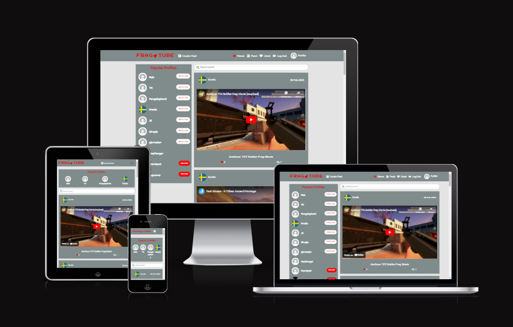
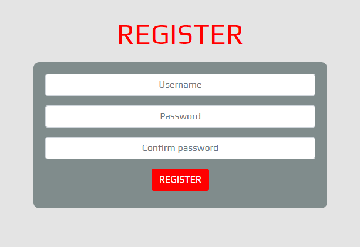
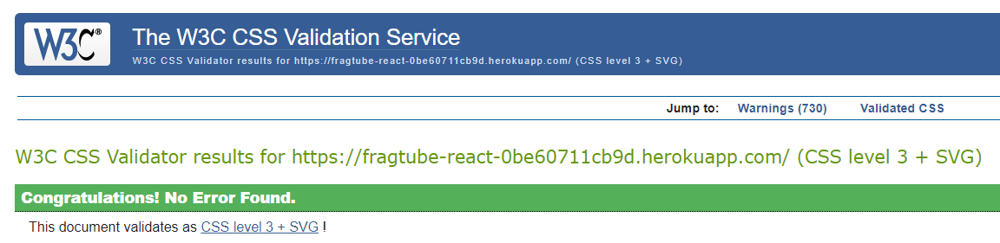

# FragTube

## Introduction

Welcome to FragTube, a video sharing platform for gamers to showcase frag movies and compilations. Users can share and discuss content with one another, follow other users to keep up to date with their posts and like posts to quickly find content they enjoy.

Link to live site: [FragTube](https://fragtube-react-0be60711cb9d.herokuapp.com/). 
Link to backend api: [FragTubeAPI](https://frag-tube-0da3a5b7d9cc.herokuapp.com/).

## Table of Contents

## UX

### User Stories

#### Navigating the Site
* As a user I can view a navbar so that I can easily navigate the site

#### Authentication
* As a user I can create an account so that I can access all the features for signed up users.
* As a user I can sign in so that I can access functionality for logged in users.
* As a user I can tell if I am logged in so that I can logged in if need be.
* As a user I can maintain my logged-in status until I choose to log out so that user experience is not compromised.
* As a user I can view user's avatars so that I can easily identify users of the application

#### Adding & Liking Posts
* As a logged in user I can create posts so that I can share frag movies with other users.
* As a user I can view details of a single post so that I can get all the information on it.
* As a logged in user I can like posts so that I can show appreciation of good content.

#### The Posts Page
* As a user I can view all the most recent posts, ordered by most recent so that I can keep up to date with new content.
* As a user I can search keywords so that I can easily find content or profiles that would be of interest to me.
* As a logged in user I can view my liked posts so that I can easily view posts I most enjoy.
* As a logged in user I can view posts from profiles I follow so that I can filter the posts I see by profiles I follow.
* As a user I can keep scrolling through posts on the site, that are loaded for me automatically so that I do not have to click on a link to the next page.

#### The Post Page
* As a logged in user I can edit my posts so that I can make corrections or update my post after creation.
* As a user I can view comments on a post page so that I can read what others think about the content.
* As a logged in user I can delete comments I have made on a post so that I can control the removal of my comment from the application.
* As a logged in user I can edit my comment so that I can update it if necessary.

#### The Profile Page
* As a user I can view other users profiles so that I can see their posts and learn more about them.
* As a user I can view statistics about a specific user so that I can leanr more about them.
* As a logged in user I can follow or unfollow other users so that I can see and remove posts by a specific user in my posts feed.
* As a logged in user I can edit my profile so that I can update my profile picture and bio.
* As a logged in user I can update my username and password so that I can change my display name and keep my profile secure.

### Admin Stories
* As an admin I can delete user's comments so that I can remove any comments which are offensive or harmful.

### Website Goals

The goals of this website are to allow users to share gaming clips and videos that they have either created themselves or find interesting. Users will have the ability to follow other users, like posts from other users and comment on posts to discuss the content. The website should allow users to share and discuss content.

### Requirements
* Home page.
* User sign up.
* User sign in.
* Create post feature for logged in users.
* Functionality for logged in users to edit their posts.
* Functionality for logged in users to like other user's posts.
* Liked posts page to allow user to filter posts to those they have liked.
* Functionality for logged in users to follow other users.
* Personal feed for users to only view posts from users they have followed.
* Profile page for users to view other users profiles and showcase their own profile.
* Functionality for logged in users to edit their profile.
* Functionality for logged in users to comment on posts.
* Functionality for logged in users to edit or delete their comments.
* Functionality for logged in users to update their username and password.

### Agile Approach

The project was mapped out with relevant user stories and tasks using github projects. The project can be found at [FragTube Project](https://github.com/users/ThomasWharton/projects/8). Issues where given labels of epic, task, must have, should have, could have and user stories.

## Design Choices

### Fonts

[Google Fonts](https://fonts.google.com/ "Google Fonts") has been used to select the fonts for the website. The font selected for the logo was [Press Start 2P](https://fonts.google.com/specimen/Press+Start+2P) as it perfectly fits the gaming theme of the website. The font [Play](https://fonts.google.com/specimen/Play) has been selected for headers and main body text as it fits the overall theme of the website and feels like it has been pulled directly from a game.

### Colours
Colours for the website where selected using [Coolors](http://coolors.co "Coolors").

* #808C8C - Battleship grey is used for the body of contents.
* #FF0000 - Red is used for the main logo and header.
* #FFFFFF - White is used for main body text.
* #E4E4E4 - Platinum is used for the background colour.

### Icons

The icons used for the site were sourced from [Font Awesome](https://fontawesome.com/ "Font Awesome").

## Structure

The structure of the site will be split into frontend and backend. The frontend of the site will be comprised using [React](https://react.dev/) components with custom [CSS](https://en.wikipedia.org/wiki/CSS) and [React Bootstrap](https://react-bootstrap.netlify.app/) for the design. The backend will be built using [Django Rest Framework](https://www.django-rest-framework.org/) which will hold all necessary data and pass it to the frontend where necessary.

### Database Models

#### Post Model

| Object     | Field         |
|------------|---------------|
| owner      | ForeignKey    |
| created_at | DateTimeField |
| updated_at | DateTimeField |
| category   | CharField     |
| title      | CharField     |
| content    | TextField     |
| embedid    | CharField     |

#### Profile Model

| Object     | Field         |
|------------|---------------|
| owner      | OneToOneField |
| created_at | DateTimeField |
| updated_at | DateTimeField |
| name       | CharField     |
| content    | TextField     |
| image      | ImageField    |

#### Like Model

| Object     | Field         |
|------------|---------------|
| owner      | ForeignKey    |
| post       | ForeignKey    |
| created_at | DateTimeField |

#### Follower Model

| Object     | Field         |
|------------|---------------|
| owner      | ForeignKey    |
| followed   | ForeignKey    |
| created_at | DateTimeField |

#### Comment Model

| Object     | Field         |
|------------|---------------|
| owner      | ForeignKey    |
| post       | ForeignKey    |
| created_at | DateTimeField |
| updated_at | DateTimeField |
| content    | TextField     |

#### Rating Model

| Object     | Field                |
|------------|----------------------|
| owner      | ForeignKey(user)     |
| post       | ForeignKey(post)     |
| rating     | PositiveIntegerField |
| created_at | DateTimeField        |
| updated_at | DateTimeField        |

### React Components

The front end was built using [React](https://react.dev/ "React"), specifically version 17.0.2. React allows for the creation and implementation of reusable components which can be used to display different features of your site. Components can have states which update depending on user interaction. The main components created for this project are listed below. These components will be discussed further in the features section of this readme.

#### NavBar

The navbar component allows users to easily navigate around the site. The navbar will change depending on whether the user is authenticated or not.

#### Post

The post component displays the content of each post to the user. This component is found reused on multiple pages such as the singular post page, home page and profile page of user who has submitted posts.

#### YoutubeEmbed

The youtube embed component embeds the youtube video in the post component. This takes the embedId posted by the user to embed the video from youtube. This component was taken from this youtube [tutorial](https://dev.to/bravemaster619/simplest-way-to-embed-a-youtube-video-in-your-react-app-3bk2).

#### Profile

The profile component displays the details of each user. Shows details of posts, following/follower/post count.

#### Popular Profiles

The popular profiles component displays a list of the top followed users. This is displayed on most pages of the site.

#### Comment

The comment component displays all comments for each post on the individual post page.

#### Rating

The rating component allows authenticated users to rate each post.

### Wireframes

Wireframes have been created using [Balsamic](https://balsamiq.com "Balsamic"). These wireframes gave a basic view of how the site will be laid out. The layout may have changed slightly in the finished product.

**Home Page Wireframe**

**Profile Wireframe**

**Sign In Wireframe**

**Sign Up Wireframe**

## Features

### Home Page

The home page will feature the most recent posts on the site and a list of popular profiles for the user to explore.

**Home Page**

### Navbar

The navbar will change dependent on whether the user is logged in or not. If the user is not logged in, they will see links to log in or sign up and one for home. If the user is logged in, they will see links for add post, home, feed, liked, sign out and profile. The navbar will be present on all pages of the site.

**Navbar Logged Out**

**Navbar Logged In**

### Sign Up Page

The sign up page will display a form for new users to create a profile of their own. The form will contain a username field, a password field and a secondary confirmation password field. There will be a submit button which will pass the details filled in to the database and create a new profile instance.

**Sign Up Page**

### Sign In Page

The sign in page will contain a form for the user to input their username and password. When submitted it will be checked, log in the user if information is correct and redirect to the home page on successful submission.

**Sign In Page**

### Avatar

The avatar component will be used to display the profile image of user profiles. It will work as a clickable link to the specific user's profile page. Users can upload their profile image and edit it at their convenience.

**Avatar** 

### Add a Post

If the user is logged in, they will be able to access the add post page from a link on the navbar. The page will contain a form for the user to create a new post and on successful submission, a new post will be created.

**Create Post Form**

### Search Bar

The search bar will be present on the home page, feed page and liked page to allow users to filter their post responses with keywords. The search function will check titles, profile names and categories that correspond to the user inputted keywords.

**Search Bar**

### Liking a Post

Logged in users will be able to like posts in which they enjoy so that they can easily find posts which they find interesting. 

### Following Users

Logged in users will be able to follow other users so that they can filter posts to those created by users which they have followed.

### Posts

Posts will be rendered on the home page, personal feed, liked page, user profile page and the individual post page. The posts will show an embedded youtube video, the title, the user who uploaded, the date on which it was uploaded, the content description, the number of likes and number of comments. On the individual post page the user will be able to view the comments on the post and add their own if they are logged in.

**Post**
**Search Bar**

### Post Page

The post page will be of individual posts. The page will display the specific post and comments for that post. If the current user is the owner of the post, there will be functionality to edit the post.

**Post Page**

### Feed Page

The feed page is for logged in users to filter posts to those from users they have followed.

### Liked Page

The liked page is for logged in users to filter posts to those of which they have liked.

### Profile Page

The profile page will display a profile image, profile bio, post count, followers count, following count and a list of the user's posts. There will be a button to follow or unfollow visible to logged in users. If the current user is the owner of the profile page, there will be functionality to edit their profile.

**Profile Page**

### Popular Profiles Component

The popular profile componet will be displayed on the home page, feed page, liked page and profile page. It will contain a list of the most followed profiles, ordered from most followers to least with a maximum length of 10 profiles. The profiles will show up as the profile avatar and the profile name. Additionally, if the user is logged in, there will be an additional button to follow/unfollow the user.

**Popular Profiles** 

### Comments

Comments will be displayed on the individual post page for users to discuss the content. Users will only be able to post comments if they are logged in. Logged in users can edit and delete their own comments. If a user is an admin, they will be able to delete other user's comments where necessary.

**Comments**

### Rating

Logged in users will have the ability to rate posts. When a user submits a rating, the rating component will update to reflect the user's submitted rating. The average rating for the post will also display if not null and update when a new rating is submitted. The rating component will not display if the user is not logged in and instead will return a link to the log in page. If no ratings have been submitted for a post yet and therefore the average rating will be null, a message that there is no ratings yet will be displayed to the user.

**Rated post** 

**Post no ratings** 

**Rating no current user** 

**No ratings** 

## CRUD Functionality

CRUD functionality is implemented in the backend to allow users on the front end to create, read, update and delete data.

### Sign up

Users can create an instance of a profile using the sign up form. Once signed up, they can log in and make use of all the functionality of the website.

### Post

Logged in users can create a post which will then be displayed on the website. Owners of a post can also edit or delete the post as they see necessary.

### Profile

Logged in users have the ability to update their profile via an edit profile form which is only visible to the owner of said profile.

### Comments

Logged in users can create comments on posts they like. The owner of the comment will also have access to edit or delete their comment.

### Rating

Logged in users can create a rating by submitting it on the post of their choosing. Rating can also be updated by submitting a new rating.

## Testing

### Front End

#### HTML Testing

HTML testing was completed by running the website through [W3C HTML Validator](https://validator.w3.org/). The results were as follows:

**HTML Validation**

The validator completed with only info warnings which can safely be ignored.

#### CSS Testing

CSS testing was completed by running the website through [W3C CSS Validator](https://jigsaw.w3.org/css-validator/). The results were as follows:

**CSS Validation**
.

The validator produced no CSS errors.

#### Manual Testing

Manual testing has been completed throughout the development process and final checks once completed. The results are shown in the table below.

| Feature Tested                                                    | Feature Description                                                        | Testing Completed                                                                                               | Expected Outcome                                                                                                                       | Result       |
|-------------------------------------------------------------------|----------------------------------------------------------------------------|-----------------------------------------------------------------------------------------------------------------|----------------------------------------------------------------------------------------------------------------------------------------|--------------|
| Sign Up/Sign In                                                   | Register an account as a new user.                                         | Complete the sign up form and sign in via sign in form with newly created details.                           | User created successfully and log in successful                                                                                     | As expected  |
| Navbar Links                                                      | Navbar links change dependent on  logged in status                      | Check logged out navbar links then log in and check logged in navbar links                                   | Navbar should display different links for logged out and logged in users.                                                           | As expected  |
| Create Post                                                       | As a logged in user, I can create a post via the create post form.      | Log in and create post.                                                                                         | Post should be created on successful create post form submission.                                                                   | As expected  |
| Edit post                                                         | As the owner of a post, I can edit my post when necessary.              | Access edit post form as post owner and complete form with changes made.                                     | Edit form should pull current post data and save new post data on successful submission.                                            | As expected  |
| Create comment                                                    | As a logged in user, I can comment on posts of interest to me.          | Log in and navigate to post, fill in comment creation form.                                                  | Comment should appear below post upon successful  submission.                                                                       | As expected  |
| Comments on post                                                  | Comments on post should only be for specific post they were created on. | Create comments on multiple posts.                                                                              | Comments should only appear below posts on which they were created.                                                                 |              |
| Edit comment                                                      | As owner of a comment, I can edit my comment when necessary.            | Access edit comment form and change comment.                                                                    | Comment should change to edited version upon successful submission of edit comment form.                                            | As expected. |
| Delete comment                                                    | As owner of a comment, I can delete my comment when necessary.          | Delete comment via dropdown menu.                                                                               | Comment should be removed upon owner deleting.                                                                                         | As expected. |
| Edit profile                                                      | User should be able to edit and update profile details.                 | Log in and navigate to own profile. Access edit profile form via drop down menu. Submit changes to database. | Upon successful submission of edit profile form, changes should be reflected on user profile.                                       | As expected. |
| Logout                                                            | User should be able to log out via navbar link.                            | Log in and click log out link on navbar.                                                                        | Once clicked, user should be logged out and navbar should reflect logged out status.                                                | As expected. |
| Like post                                                         | Logged in user should be able to like post                                 | Log in and like a post, check that liked post appears in liked post feed.                                    | Once liked, like icon should change colour and liked post should appear in users liked post feed.                                   | As expected. |
| Follow User                                                       | Logged in users should be able to follow other users.                      | Log in and follow a user. Check that the followed users posts appear in following users personal feed.       | Once followed, followers personal feed should show posts from followed user.                                                        | As expected. |
| Unfollow User                                                     | User should be able to unfollow a user they have followed.                 | Log in and unfollow previously followed user.                                                                   | Once unfollowed, following users personal feed should no longer show posts from previously followed user.                           | As expected. |
| Rate post                                                         | Logged in user should be able to rate a post.                              | Log in and rate a post.                                                                                         | Once rated, stars should turn red to indicate user rating. Average rating of post should update on rating submission.               | As expected. |
| Update rating                                                     | Logged in user should be able to update their rating of post.              | Log in and change rating of previously rated post.                                                              | Once rating updated, rating component should update to reflect new rating value. Average rating should also update.                 | As expected. |
| Unauthenticated user  unable to rate post                      | Unauthenticated user should not be able to rate post.                      | Log out and try to rate post.                                                                                   | Rating component should not display if not logged in. Instead link to log in page should display.                                   | As expected. |
| Display average rating icon only if average rating not null | If post has no ratings, no star icon for average rating should display. | Check post with no rating to ensure star icon does not display.                                              | No star icon for average rating should display if no average rating. Instead a message of "No ratings yet!" should be displayed. | As expected. |

### Bugs

There is a bug in which all comments for all posts are being displayed on every post instead of only the posts they were originally created from.

I tried to fix this issue by adding additional checks and conditions to setting the comments on each post but unfortunately this resulted in no comments being generated at all.

Due to time constraints, I was not able to fix this bug.

## Future Development

* Fix comment bug
* Allow admins to remove posts and comments which do not fit the website or are offensive.
* Set up api to store video so that users can upload their own videos rather than embedding them from youtube.

## Technologies Used

### Languages

* [HTML](https://en.wikipedia.org/wiki/HTML "HTML")
* [CSS](https://en.wikipedia.org/wiki/CSS "CSS")
* [JavaScript](https://en.wikipedia.org/wiki/JavaScript "JavaScript")
* [Python](https://en.wikipedia.org/wiki/Python_(programming_language) "Python")

### Libraries & Framework

* [Django](https://en.wikipedia.org/wiki/Django_(web_framework) "Django")
* [React Bootstrap v4.6](https://react-bootstrap-v4.netlify.app/ "React Bootstrap")
* [Google Fonts](https://fonts.google.com "Google Fonts")

### Databases
 * [PostgreSQL](https://www.postgresql.org/ "PostgreSQL")
 * [ElephantSQL](https://www.elephantsql.com/ "ElephantSQL")

### Tools

* [GitHub](https://github.com "GitHub")
* [Gitpod](https://gitpod.io "Gitpod")
* [Balsamic](https://balsamiq.com "Balsamic")
* [Coolors](http://coolors.co "Coolors")
* [DevTools](https://developer.chrome.com/docs/devtools "DevTools")
* [Gunicorn](https://en.wikipedia.org/wiki/Gunicorn "Gitpod")
* [Cloudinary](https://cloudinary.com/ "Cloudinary")
* [Heroku](https://heroku.com "Heroku")
* [Psycopg](https://wiki.postgresql.org/wiki/Psycopg "Psycopg")

## Development and Deployment

### Development

#### Forking GitHub Repository

Forking allows you to make a copy of a chosen repository to your own GitHub account. This allows you to test and edit the project without making changes to the original. Forking is done by following these steps.

1. Whilst logged into your GitHub account, navigate to the repository you would like to fork.
2. Click on the **Fork** button at the top right of the page.
3. Choose a name to give the repository. It will be intially named as the same as the original repository.
4. Click the **Create Fork** button.

#### Cloning GitHub Repository

Cloning allows you to download a local version of a chosen repository. Cloning can be done by following these steps.

1. Whilst logged into your GitHub account, navigate to the repository you would like to clone.
2. Click the green **<> Code** button.
3. Click on the **Local** tab.
4. Select **HTTPS** and copy the url.
5. Open your chosen IDE and ensure Git is installed.
5. In your IDE terminal type **git clone (url link that you copied)** and hit enter.

#### Cloudinary

1. Navigate to [Cloudinary](https://cloudinary.com/ "Cloudinary") and create an account.
2. Log in.
3. Navigate to your dashboard and copy the API Enviroment variable.
4. Keep a note of this variable as you will need to add it to your env.py file in your project.

#### ElephantSQL

1. Navigate to [ElephantSQL](https://www.elephantsql.com/ "ElephantSQL") and create an account.
2. Once logged in, create new instance.
3. Select a plan, Tiny Turtle is the free to use plan.
4. Select a region, one closest to yourself.
5. Click create instance.
6. Select newly created instance.
7. Copy and make note of instance URL as this will be added to your env.py file.

#### Requirements

The requirements for this particular project are as follows: 

asgiref==3.7.2
cloudinary==1.37.0
dj-database-url==0.5.0
dj-rest-auth==2.1.9
Django==3.2.23
django-allauth==0.44.0
django-cloudinary-storage==0.3.0
django-cors-headers==4.3.1
django-filter==23.5
djangorestframework==3.14.0
djangorestframework-simplejwt==5.3.1
gunicorn==21.2.0
oauthlib==3.2.2
Pillow==10.1.0
psycopg2==2.9.9
PyJWT==2.8.0
python3-openid==3.2.0
pytz==2023.3.post1
requests-oauthlib==1.3.1
sqlparse==0.4.4

You can update your requirements file using the command in your IDE terminal: 
`pip freeze > requirements.txt` 
This is handy command to know for when you install any new components which would then be needed to be added to your requirements.

You can install all requirement packages using the following command in your IDE terminal: 
`pip3 install -r requirements.txt` 
*Disclaimer: Please check Python documentation for the correct terminal command as it may differ depending on the system you are using*

### Deployment

#### Backend

##### env File

You need to create an env.py file in the root folder of your repository. This is where you assign hidden variables for security reasons. This file must be added to your list of ignored files in git.ignore to ensure it does not get pushed up to your repository on GitHub as it would then be publicly accessible. Variables for this project should be as follows.

* DATABASE_URL: elephantSQL instance URL
* SECRET_KEY: Secret key of your choosing. Can be generated using [Django Secret Key Generator](https://miniwebtool.com/django-secret-key-generator/).
* CLOUDINARY_URL: assign it your API Enviroment variable (you need to remove everything before cloudinary://).
* DEV: "1" - This is set to allow debug mode only when in development by checking to see if this value exists in the env file. This variable will not be present in the deployed version and therefore will set debug to false.
* ALLOWED_HOST: This is set to your development url.

This project was deployed using [Heroku](https://www.heroku.com "Heroku") by following the steps detailed below.

##### Heroku Backend
1. Navigate to Heroku website and sign up or log in.
2. Navigate to your dashboard, select **New** and then **Create New App**.
3. Assign a unique name to your project, select your region and click **Create app**.
4. Navigate to **Settings** tab.
5. You need to add specific config vars to be able to deploy the project properly on Heroku. This is done by clicking on **Reveal Config Vars**, and adding them here. The config vars needed are listed below:  
CLOUDINARY_URL = Same as your CLOUDINARY_URL in your env.py. 
DATABASE_URL =  Same as your DATABASE_URL in your env.py. 
ALLOWED_HOST = Set to deployed site url without https://.
CLIENT_ORIGIN = Frontend deployed site url.
CLIENT_ORIGIN_DEV = This is set to your development url.
SECRET_KEY = Another secret key here - Make sure it is different to the one in your env.py file for security reasons.

#### Frontend

#### Deploying from a Github Repository

1. Navigate to **Deploy** tab.
2. Select **GitHub - Connect** for deployment method and connect your GitHub account by logging in with your GitHub details in the prompt.
3. Select your GitHub account from the dropdown list if not already preselected.
4. Search for your GitHub repository that you would like to deploy and click **Connect** on the respository in the search list.
5. Deployment options are found further down the **Deploy** tab with options for **Automatic Deploys** and **Manual Deploy**. Automatic deploys all for heroku to update your app everytime your GitHub is updated.
6. Choose your deployment option and the branch from which you would like to deploy.
7. If **Automatic deploys** is chosen, click on **Enable Automatic Deploys**. If **Manual deploy** chosen, click on **Deploy Branch**.
8. Heroku should now start the deployment process. Once successfully deployed, a message will appear saying **Your app was successfully deployed.** with a button to view your deployed application.

## Credits

The base for this project was built following the moments walkthrough project from CodeInstitute. The project was altered through development to meet the site goals.

The youtube embed component used in the project was found here: [Youtube Embed](https://dev.to/bravemaster619/simplest-way-to-embed-a-youtube-video-in-your-react-app-3bk2).

As always, I want to give my mentor [Simen Daehlin](https://github.com/Eventyret "Simen Daehlin") for his continued support and guidance throughout the course. 

